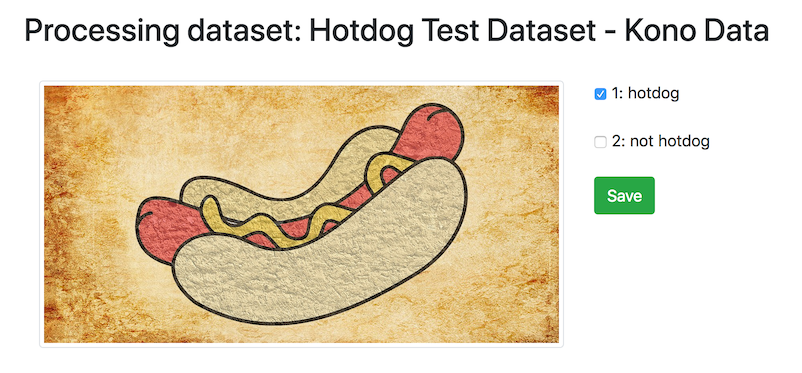
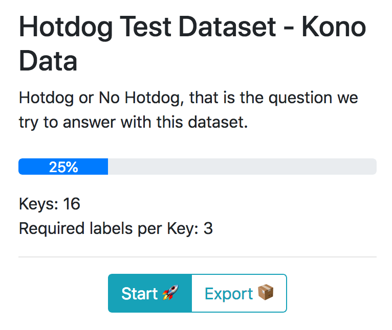

kono data
===========
> a simple label-it-yourself app - for more structure in your data

## Why do I need it?
_kono data_ provides an easy way to label unstructured datasets.
If have a folder of images, it helps you assign each file one or more labels. 

## How can I use it?
You can use the hosted version ([HERE](https://61traccl80.execute-api.eu-west-1.amazonaws.com/prod/dataset/public)) or install it on your own server, see <b>Installation</b>.

You provide Kono Data with a path to your dataset (currently only AWS S3 is supported) and possible labels for each datapoint.

## How does the processing flow look like?
On the left side you see an image and on the right its possible labels.
Click the checkbox or type the number and a label is selected.
One or all labels can be selected. If you click _Save_ or hit enter your input is saved for this image and the next one in the dataset is loaded.



## How can I see the labeling progress of a dataset?
## How can I export a dataset?


## [FAQ](FAQ.md)
  
## Installation
This app is written in Python 3 and based on [Django](https://www.djangoproject.com/).
Python requirements are listed in the ```requirements.txt``` and can be installed with ```pip install --upgrade -r requirements.txt```. 

## Contribute
You're encouraged to contribute to kono data! 
There are several ways to expand the project: you can fix a bug, translate content or work on new features. Your ideas are welcome! If you need a start, several bugs and future features are listed below. If you have questions open an issue on [Github](https://github.com/hellno/KonoData/issues) and we can discuss. A few questions and common problems are answered in the [FAQ](FAQ.md).

## Bugs
- progress bar does not start in the beginning of the bar =/
- only public S3 buckets are supported
- ... (your bug can be listed here)

## Future features
These are some ideas I've been thinking about, going from most obvious to most far-fetched:

1. Add gamification with leaderboards in each dataset and across the whole site
2. Make every label an object with label, title and description
3. Export confidence ratio if multiple user labeled the same datapoint
4. Add more content types: video, sound, gif
5. Add comparison task with labels, e.g. "Which image has more people in it?"
6. Train and export deep-learning model on click of a button

## Awesome, but why the weird name?
For no particular reason (knowledge-annotate-data) this project is named after [Hyōichi Kōno](https://en.wikipedia.org/wiki/Hy%C5%8Dichi_K%C5%8Dno), a Japanese adventurer, best known for circling Japan on a bike.

## License
kono data is released under the MIT License.
